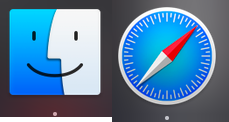

# Go Image Editing Command Line Tools
golang command line image editor

## gidit
Resize png file
```
gidit 1000 file.png
gidit 1000 500 file.png
```
If only one size is given the aspect ratio will be maintained

## gadd
Append an image, to the left of an image


<br />


```
gadd one.png two.png
```
Result is newtwo.png 


## gbot
Append an image to the bottom of an image

```
gbot newtwo.png newtwo.png
```

Result is newnewtwo.png


