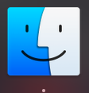
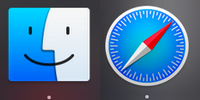
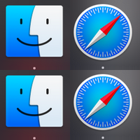

# Go Image Editing Command Line Tools
golang command line image editor
Use one command, gidit or install them all seperately

# Install

```
go get github.com/bsdpunk/gidit
```


## gisize
Resize png file
Examples:
```
gidit 1000 file.png
gidit 1000 500 file.png
```
If only one size is given the aspect ratio will be maintained

Sample:



```
gidit 30 one.png
```

Result is newone.png


## giadd
Append an image, to the left of an image


<br />


```
gidit -o add one.png two.png
```
Result is newtwo.png 




## giappend
Append an image to the bottom of an image


```
gidit -o append newtwo.png newtwo.png
```

Result is newnewtwo.png




